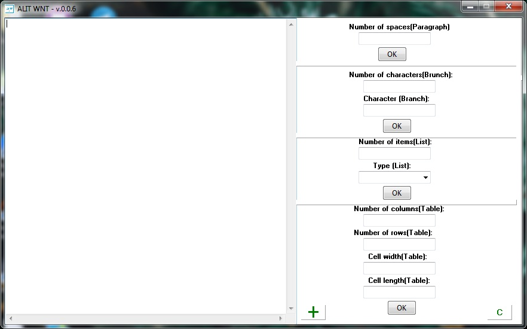

<h1>WNT - best programm for you!</h1>
<h3>Platfotm:OS Windows</h3>
<h3>Version:0.0.8</h3>
<h3>Interface Language:English</h3>
<h3>Abilities:</h3>

     •Paragraphs

     •Lists

     •Departments

     •Tables

     •Special symbols

     •Pictures

<h3>Run:</h3>

1.Download WNT.exe

2.Run WNT.exe

<h3>Features:</h3>

If you pressed "Caps Lock",program will warn you.

<h3>Screenshots:</h3>

